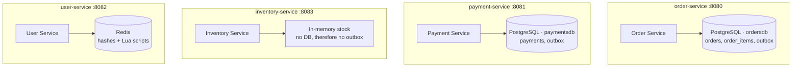
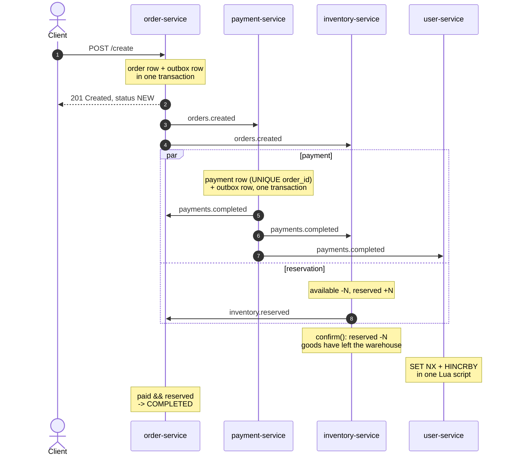
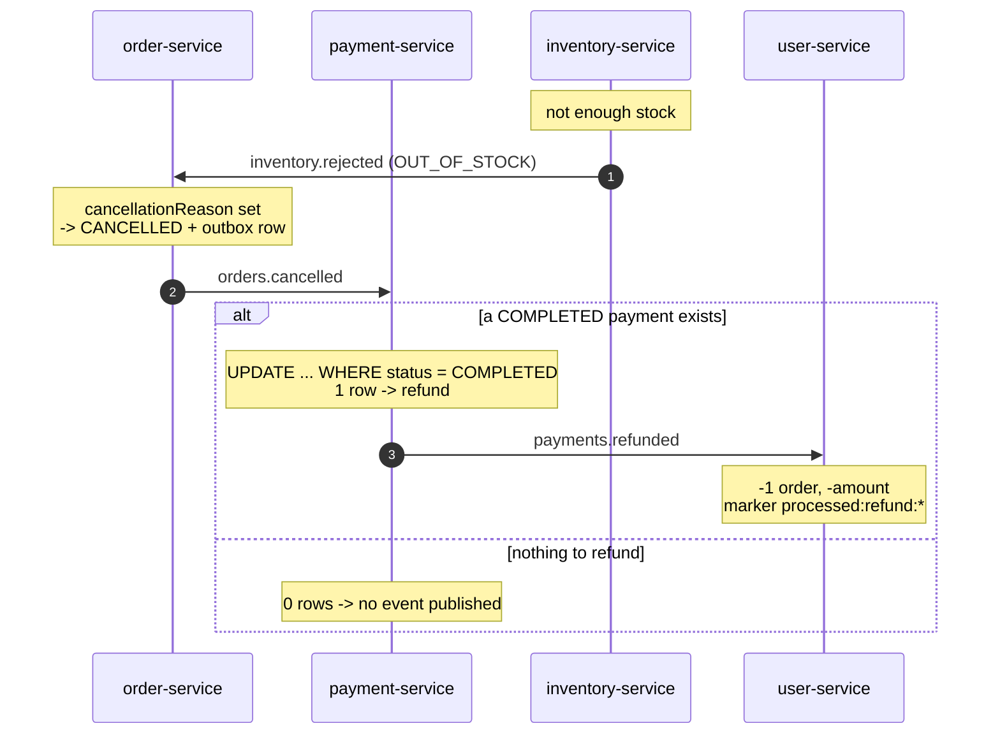

# Flower Shop Microservices

## Overview
- Flower shop. This is a learning playground for event-driven patterns, not a product. 
- Customer orders flowers. Order should be paid and flowers should be reserved on the stock.
- The choice of flowers was deliberate: they **wither**, meaning the reservation has an expiration time, and the delivery has a specific date and time. This naturally leads to a need for delayed messages—in other words, RabbitMQ. (not implemented yet)
## Tech Stack
- Java 17, Spring Boot 3.5, Kafka, PostgreSQL, Redis, Lombok, Spring Kafka, Flyway, Docker Compose, JUnit 5 + Mockito.

## Getting Started
    docker compose down -v
    docker compose up --build

| UI | URL |
|---|---|
| Kafka UI | http://localhost:8084 |
| order-service | http://localhost:8080 |
| inventory stock | http://localhost:8083/stock |
| customer stats | http://localhost:8082/customers/{id}/stats |

Create an order:

    curl -X POST http://localhost:8080/create \
    -H "Content-Type: application/json" \
    -d '{"customerId":"99999999-9999-9999-9999-999999999999","items":[{"flowerId":"11111111-1111-1111-1111-111111111111","quantity":1}]}'

### Seeded stock (`inventory-service`, in memory)

| flowerId | flower | available |
|---|---|---|
| `11111111-…` | Rose | 20 |
| `22222222-…` | Tulip | 30 |
| `33333333-…` | Peony | 40 |
| `44444444-…` | Hydrangea | 20 |
| `55555555-…` | Daisy | 15 |

Price is `100` per item, `payment.decline-above` is `5000`.

## Scenarios
| Scenario | How to trigger | Expected |
|---|---|---|
|Happy path	| 1 rose → 100 | COMPLETED, stats +1 |
| Out of stock | 25 roses → 2500, stock is 20 | CANCELLED / OUT_OF_STOCK; payment succeeded, so a refund is published and stats go back |
| Payment declined | 30 tulips + 40 peonies → 7000 | CANCELLED / PAYMENT_FAILED; the reservation is released, nothing to refund |


## Architecture
### Service Overview

| Service | Consumes | Produces | Storage |
|---|---|---|---|
| **order-service** (8080) | `payments.completed`, `payments.failed`, `inventory.reserved`, `inventory.rejected` | `orders.created`,`orders.cancelled` | Postgres (Flyway) |
| **payment-service** (8081) | `orders.created`,`orders.cancelled` | `payments.completed`,`payments.refunded`, `payments.failed` | Postgres (Flyway) |
| **inventory-service** (8083) | `orders.created`, `payments.completed`, `payments.failed` | `inventory.reserved`, `inventory.rejected` | in memory |
| **user-service** (8082) | `payments.completed`,`payments.refunded`| — | Redis

### Order Service
The main aim of Order Service is to store orders and manage their statuses.  There is  Postgres DB, where orders and their statuses are stored.

Order service has public api `POST /create` with `customerId` and flower list, using which we can create an order. After the order is  stored in db with the status NEW, we create an outbox event and store it in db with processed =false.

We use an outbox pattern, to make sure that each new order is published in `orders.created` at least once.
To publish events from outbox, we  have the scheduled task(every 5 seconds), where we get top unprocessed 10 events from db, and  publish it.

`orders.created` topic in kafka is listened to by Payment service and Inventory service.

Order service subscribes on `inventory.rejected`, `payments.failed`,`payments.completed`,`inventory.reserved` topics, and updates the order status accordingly.

The order stays NEW until both facts arrive and becomes COMPLETED when
paid && reserved. A rejection from either side (`inventory.rejected`,
`payments.failed`) makes it CANCELLED and is terminal.

A cancellation is also written to the outbox and published as
`orders.cancelled`, which is what triggers the refund.

<details><summary>Event contracts</summary> 

**OrderCreated** → `orders.created`

| field | type |
|---|---|
| `orderId` | UUID  |
| `customerId` | UUID |
| `items` | `[ { flowerId, quantity } ]` |
| `totalAmount` | BigDecimal |
| `createdAt` | Instant |


**OrderCancelled** → `orders.cancelled`

| field | type |
|---|---|
| `orderId` | UUID |
| `customerId` | UUID |
| `reason` | `OUT_OF_STOCK`,`UNKNOWN_FLOWER`,`PAYMENT_FAILED` |
| `totalAmount` | BigDecimal |
| `cancelledAt` | Instant |
</details>

### Payment Service
Payment service has  Postgres DB, where payments and their statuses are stored.

If Payment service receives the event, it checks if we can process the payment (as for now the max amount for one order is configurable threshold (`payment.decline-above`)).
Both the payment row and its event are written in one transaction — see [Transactional outbox](#transactional-outbox).

If payment processed, payment status is changed to COMPLETED and `payments.completed` event is written to the outbox, on the other hand status becomes FAILED and the event is `payments.failed`.

Payment service also consumes `orders.cancelled`. If a COMPLETED payment exists
for that order, it is marked REFUNDED and `payments.refunded` is published. The
refund is a conditional update (`WHERE status = COMPLETED`), so a redelivered
cancellation, a declined payment or an already refunded one all update zero rows
and publish nothing.

<details><summary>Event contracts</summary> 

**PaymentCompleted** → `payments.completed`

| field | type |
|---|---|
| `paymentId` | UUID |
| `orderId` | UUID |
| `customerId` | UUID |
| `amount` | BigDecimal |
| `paidAt` | Instant |


**PaymentFailed** → `payments.failed`

| field | type |
|---|---|
| `paymentId` | UUID |
| `orderId` | UUID |
| `customerId` | UUID |
| `amount` | BigDecimal |
| `failedAt` | Instant |


**PaymentRefunded** → `payments.refunded`

| field | type |
|---|---|
| `paymentId` | UUID |
| `orderId` | UUID |
| `customerId` | UUID |
| `amount` | BigDecimal |
| `refundedAt` | Instant |
</details>

### Inventory Service
Inventory service  receives `orders.created` event , check if stock contains enough items to fulfil an order.

if yes, the service reserves items in the stock, changes order reservation status to HELD  and  publishes `inventory.reserved` event.
If not, it publishes `inventory.rejected` event with the reason. there are 2 possible reasons :  OUT_OF_STOCK (not enough items in the stock),UNKNOWN_FLOWER (no flower with the id found).


Additionally, the Inventory service listens to  `payments.completed` and `payments.failed` topics.

In inventory service we think that order is finished when its reservation status changes from HELD to CONFIRMED.
it means that firstly we need to reserve the flowers, then get `payments.completed` for this order, purchase flowers and change reservation status to CONFIRMED.

However, there can be a scenario , when we could reserve flowers in Inventory service, but Payment was rejected. To cover that case, Inventory service  listens to `payments.failed`, and release flowers from the order and marks reservation status as RELEASED.
<details><summary>Event contracts</summary> 

**InventoryReserved** → `inventory.reserved`

| field | type |
|---|---|
| `orderId` | UUID |
| `items` | `[ { flowerId, quantity } ]` |
| `reservedAt` | Instant |

**InventoryRejected** → `inventory.rejected`

| field | type |
|---|---|
| `orderId` | UUID |
| `reason` | `OUT_OF_STOCK`, `UNKNOWN_FLOWER` |
| `flowerIds` | `[ UUID ]` |
| `rejectedAt` | Instant |
</details>

### User Service

Keeps per-customer statistics: how many orders they completed and how much
they spent. It consumes `payments.completed` and `payments.refunded` and is
the only service with no outgoing events.

Statistics live in Redis: one hash per customer (`customer:<customerId>` with
`ordersCount` and `totalSpentCents`), plus a short-lived marker per processed
event. Money is stored as an integer number of cents — `HINCRBYFLOAT` exists
but floating point has no place in money.

Each update runs as a single Lua script, because the deduplication marker and
the counters must move together:

- `add-payment.lua` — `SET processed:payment:<paymentId> NX` and, only if that
  succeeded, two `HINCRBY`. A redelivered payment finds the marker and changes
  nothing.
- `remove-payment.lua` — the mirror image for refunds, under its own key
  `processed:refund:<paymentId>`. The refund carries the *same* `paymentId` as
  the original payment, so reusing the first namespace would make every refund
  look like an already-processed payment.

`remove-payment.lua` also refuses to go negative. If the stats are lower than
the amount being refunded, the original payment was never counted — the script
touches nothing and returns `-1`, the listener throws, and the message is
retried. `payments.completed` and `payments.refunded` are different topics with
no ordering between them, so "the payment has not arrived yet" is a normal race,
not a corrupted state. Crucially the marker is written only on the success
path, so a retry can still succeed later.

Statistics are a **projection**, not a source of truth: everything here can be
rebuilt by replaying the topics from offset 0. That is why Redis is enough,
while payments live in Postgres.

## Design Decisions 

### Transactional outbox

Saving an order and publishing `orders.created` are two independent
operations against two different systems. Whatever order you put them in,
the service can die in between:

- publish first, then commit → the event is out, the order does not exist;
- commit first, then publish → the order exists, nobody hears about it.

This is the dual-write problem, and no arrangement of the two calls solves it.

Instead, `order-service` and `payment-service` write the event into an
`outbox` table **in the same transaction** as the state change. One commit,
one atomic outcome: either both rows are there or neither is. A scheduled
publisher then polls unprocessed rows, sends them to Kafka and flips
`processed` to true.

The publisher can also crash between a successful send and that flag, so the
same event may be published twice. The outbox guarantees **at least once**,
never exactly once — which is why every consumer in this project is
idempotent.

`inventory-service` has no outbox: its state lives in memory, and there is no
transaction to join. Its dual-write hole is a known limitation.

Publishing straight from the listener does not survive contact with
idempotency. Suppose `payment-service` inserts a payment row, commits, and
then fails to reach Kafka. The message is retried, the insert hits
`UNIQUE (order_id)`, the guard correctly reports "already handled" — and the
event is never published. The protection that makes redelivery safe is
exactly what makes the lost event unrecoverable.

With the outbox there is nothing to reconcile: the guard and the event row
are decided by the same commit, so "already handled" is also "already
queued".

### Idempotency
Kafka delivers at least once, so a redelivered event must be safe for every
consumer.

- **payment-service** — `UNIQUE (order_id)`: the guarantee comes from the
  database engine, not from application code.
- **user-service** — `SET NX` + `HINCRBY` in a single Lua script, so the
  check and the increment cannot be separated by another client.
- **inventory-service** — a redelivered `orders.created` replays the stored
  reservation instead of computing a new answer; the same input always
  produces the same reply, even after the stock has changed.
- **`paymentId` is derived from `orderId`**, not generated.

The last one came from a real bug: `paymentId` used to be
`UUID.randomUUID()`, so every redelivery produced a *different* id and
user-service counted the same payment twice. Deduplication only works when the
key is derived from the business identity of the event.

### Retry vs DLQ: "not yet" vs "never"

Kafka delivers at least once, so every consumer has to decide what a failure
means before deciding how to react. The question is always the same:

> Would the same operation produce a different result two seconds from now?

**Yes — "not yet".** Throw. Spring moves the message to a retry topic, the rest
of the queue keeps flowing, and a later attempt succeeds once the missing piece
arrives. After the last attempt the message lands in the dead-letter topic,
where a human can look at it.

**No — "never".** Log and acknowledge, or exclude the exception from retrying so
it goes straight to the DLQ. Retrying something that cannot change only burns
attempts and hides the real problem.

| Situation | Time helps | Action |
|---|---|---|
| Redis / Postgres / Kafka unreachable | yes | throw → retry |
| The data isn't there yet (cross-topic race) | yes | throw → retry |
| Malformed or empty payload | no | log + ack, or `exclude` → DLQ |
| State is already terminal | no | log + ack |
| Duplicate delivery | no | log + ack |

Two lines from `StockStore` that look alike and mean the opposite:

```java
// payments.completed can overtake orders.created - they are different topics
// with no ordering between them, so the reservation may simply not exist yet
if (reservation == null) {
    throw new IllegalStateException("No reservation yet for order " + orderId);
}

// a released or rejected reservation will never become HELD again
if (reservation.status() != ReservationStatus.HELD) {
    log.info("Order {} is {}, confirm ignored", orderId, reservation.status());
    return;
}
```

Getting this wrong is asymmetric. A needless retry costs a few seconds and some
log noise. Swallowing a temporary failure loses the message silently: no
exception, nothing in the DLQ, and the numbers stop adding up a week later.
When in doubt, throw.


### Why is order status determined based on two boolean flags?
Order status is not advanced step by step; it is derived from two independent facts (paid, reserved). The two events arrive on different topics `payments.completed` and `inventory.reserved` with no ordering guarantee between them, so any linear state machine would depend on which one happens to arrive first.

### Service ownership

Each service owns its storage. No shared database.



### Topic routing

| Topic | Produced by | Consumed by |
|---|---|---|
| `orders.created` | order | payment, inventory |
| `payments.completed` | payment | order, inventory, user |
| `payments.failed` | payment | order, inventory |
| `inventory.reserved` | inventory | order |
| `inventory.rejected` | inventory | order |
| `orders.cancelled` | order | payment |
| `payments.refunded` | payment | user |

Every consumer has its own retry-topic chain and dead-letter topic, suffixed
with the consuming service so that two services never share one.

### Happy path



`par` is not decoration: payment and inventory consume `orders.created`
independently and there is no ordering between their replies. That is why the
order status is derived from two independent flags rather than advanced through
a sequence of states.

### Compensation



`alt` is not decoration either: zero rows updated means there is nothing to
refund and no event is published, which is what makes the compensation
idempotent — a redelivered `orders.cancelled` takes the second branch.

The `payments.failed` branch is the mirror image: payment declines the charge,
order sets `CANCELLED` and publishes `orders.cancelled`, and inventory calls
`release()` to put the flowers back.

## Testing

Unit tests only, no Spring context, no Kafka, no database — everything runs in
milliseconds and can be executed with `mvn test`.

| What | Where | Why it matters |
|---|---|---|
| Stock arithmetic and its invariant | `StockStoreTest` | `available + reserved` never changes on reserve or release; `confirm` is the only operation that lowers the total, because that is when goods actually leave |
| Reserve reservation process | `ReserveStockStoreTest` | redelivered `orders.created` return an existing reserve item and don't process the new one |
| Confirm reservation process | `ConfirmStockStoreTest` | `confirm` before reserve throws `IllegalStateException`, so message is retried, `confirm` after `release` is ignored,   `confirm` rejected order is ignored, replay `confirm` still reports success |
| Release reservation process | `ReleaseStockStoreTest` | `release` twice does not return stock twice, `release` rejected order is ignored, `release` before reserve throws `IllegalStateException` |
| Order complete logic | `OrderStatusTest` | order becomes COMPLETED regardless of the order of appearance paid and reserved |
| Rejection reason mapping | `CancellationReasonMappingTest` | each `RejectionReason` has a corresponding `CancellationReason`; we need to catch instances where a reason is added to the inventory-service but forgotten in the order-service|
| Incoming message | `InventoryListenerTest` / `PaymentListenerTest` | A rejected order generates exactly one event with a reason; an empty payload does not crash the listener|

### Not covered

- **No integration tests.** Nothing runs against a real Kafka or Postgres, so
  serialization, consumer group behaviour and Flyway migrations are only ever
  verified by hand through `docker compose up`. Testcontainers is the obvious
  next step.

## Known limitations

This is a learning playground, not a product. The list below separates things
that are deliberately out of scope from things that are simply not done yet —
both are known, neither is an accident.

### Deliberate

- **`inventory-service` keeps stock in memory.** No database means no
  transaction to join, so the transactional outbox is impossible there. Its
  dual-write hole is real and was observed live: stock was decremented while
  the event never reached Kafka. Closing it requires giving the service a
  database first.
- **Two logical databases in one Postgres instance.** `ordersdb` and
  `paymentsdb` are separate schemas owned by separate services, but they share
  one container to keep `docker compose up` a single command.
- **No authentication, no CI.** Out of scope for the goal of the project.

### Not done yet

- **No request validation.** `CreateOrderRequest` is accepted as-is, which is
  why `UNKNOWN_FLOWER` is reachable at all — an order can reference a flower
  that does not exist. With validation in place that rejection reason would
  become a pure signal that something is wrong inside the system rather than a
  normal outcome.
- **Prices are hardcoded** (`unitPrice = 100`). The `flower_prices` table
  exists but is never populated, and no service owns pricing yet.
- **`TIMESTAMP` instead of `TIMESTAMPTZ`.** Timestamps are stored without a
  zone. `Instant` is UTC on the Java side, so nothing is wrong today, but the
  database itself carries no proof of that.
- **RabbitMQ is not integrated.** Flowers wither, so reservations should expire
  and deliveries are scheduled for a specific time — both call for delayed
  messages, which Kafka does not do well. This is the intended next chapter.
